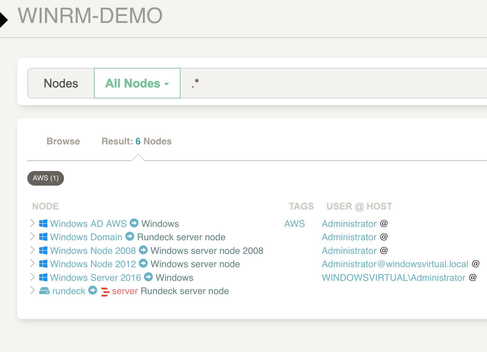

# Rundeck image with winrm python plugin

This is an official Rundeck OSS image for testing winrm plugin. 
It has a default project example

## Set python version
On docker-compose.yml set python version you want to try (`PYTHON_VERSION`)

## Set windows resources model
On `docker/resources` put the Rundeck resource files (xml or yaml) with the windows nodes.
Also, you will need to add the password key storage to connect to the nodes.

Rundeck will be available on `http://localhost:4441`



## Build process

Use `start-docker-example.sh` to build and copy the plugin to the docker image

## Make commands available 

```
make build
```

```
make start
```

```
make clean
```

